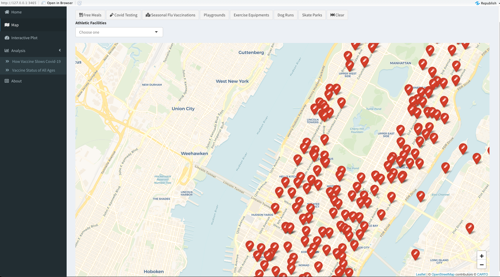

# Project 2: Shiny App Development




## COVID-19 Vaccine Impact on NYC ([link to Shiny App](https://jeesunyun.shinyapps.io/project2_app/))
Term: Fall 2021
Team #7
+ Team members:
	+ Yun, Jee sun jy3112@columbia.edu
	+ Xia, Mingyuan mx2204@columbia.edu
	+ Wang, Ziyi zw2732@columbia.edu
	+ Wang, Wanxin ww2581@columbia.edu


+ **Project summary**: Since COVID-19 vaccines became available to all New York residents 16 and over [beginning April 6](https://www.governor.ny.gov/news/governor-cuomo-announces-new-yorkers-30-years-age-and-older-will-be-eligible-receive-covid-19), many parts of the life in the city is seeming to return to Pre-Covid. We believe that new mask regulations and decisions regarding reopening of restaurants and other cultural activities in New York are based on statistics of COVID cases. So, in our app we look at how COVID-19 has impacted out lives in terms of statistics. Plus, a useful map to locate resources in New York.
 
+ **Contribution statement**:
+ Ziyi built the basic framework for the Shiny app and the Interactive plots. Wanxin and Mingyuan were in charge of providing analysis. Jeesun and Wanxin collected the data needed for this project. Wanxin and Jeesun were responsible for implementing the map. Jeesun made meeting notes on github.issues and debugged codes while deploying. All team members participated in brainstorming and discussing ideas. All team members contributed to the GitHub repository and prepared the presentation. All team members approve our work presented in our GitHub repository including this contribution statement.

Following [suggestions](http://nicercode.github.io/blog/2013-04-05-projects/) by [RICH FITZJOHN](http://nicercode.github.io/about/#Team) (@richfitz). This folder is orgarnized as follows.

```
proj/
├── app/
├── lib/
├── data/
├── doc/
└── output/
```

Please see each subfolder for a README file.

